# Ciberseguridad 2026 - Laboratorios Prácticos

Instituto Profesional Santo Tomás Iquique

**Nombre:** Martín Obregón Díaz  
**Carrera:** Ingeniería en Informática  
**Asignatura:** Ciberseguridad  

---

# Descripción

En este repositorio se documentan los laboratorios realizados en la asignatura de Ciberseguridad, utilizando máquinas virtuales con Kali Linux y Ubuntu Server para simular escenarios reales de ataque y defensa.

Los laboratorios tienen como objetivo comprender el funcionamiento de herramientas de criptografía, ataques de credenciales, autenticación multifactor y protección de servicios críticos.

---

# Entorno de Trabajo

- Kali Linux (Máquina atacante)
- Ubuntu Server (Máquina víctima)
- OpenSSL
- Hydra
- Google Authenticator
- SSH

---

# Lab 1 - Criptografía e Integridad de Datos

## Objetivo

Aplicar técnicas de hashing y firma digital para verificar la integridad de archivos y detectar modificaciones no autorizadas.

---

## Creación del archivo

Se creó un archivo llamado `config_bancaria.txt` utilizando la terminal de Kali Linux.

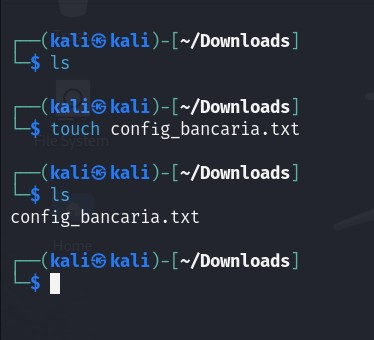

Posteriormente se editó el contenido del archivo utilizando el editor Nano.

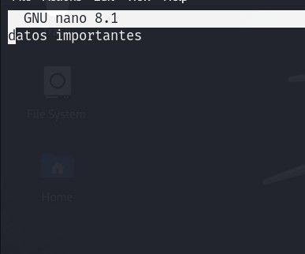

---

## Generación de llave privada

Se generó una llave privada RSA de 2048 bits utilizando OpenSSL.

```bash
openssl genrsa -out privada.pem 2048
```

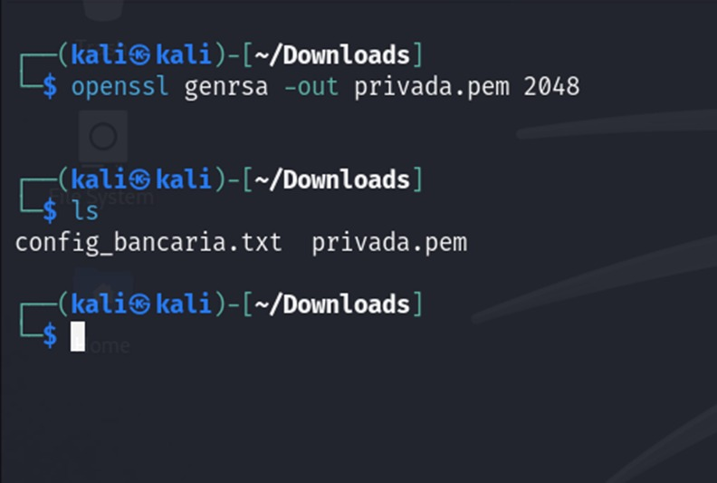

---

## Generación de llave pública

A partir de la llave privada se generó la llave pública.

```bash
openssl rsa -in privada.pem -pubout -out publica.pem
```

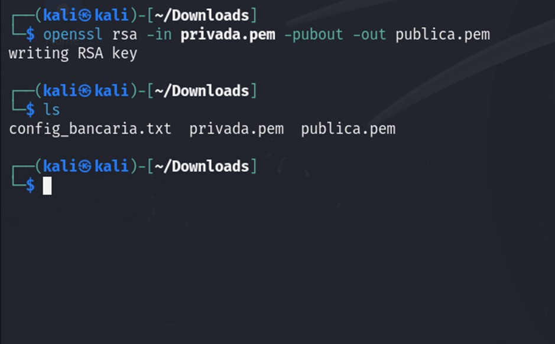

---

## Firma digital del archivo

Se realizó la firma digital del archivo utilizando SHA-256.

```bash
openssl dgst -sha256 -sign privada.pem -out firma.bin config_bancaria.txt
```

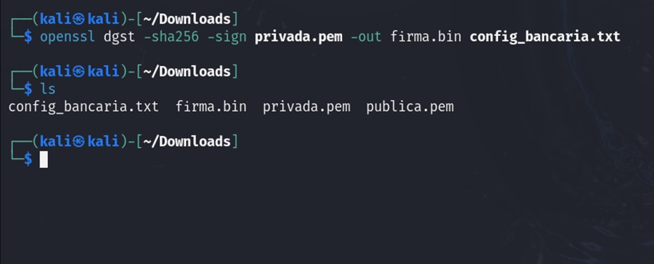

---

## Verificación de firma

Se verificó correctamente la firma digital utilizando la llave pública.

```bash
openssl dgst -sha256 -verify publica.pem -signature firma.bin config_bancaria.txt
```

La verificación fue exitosa.

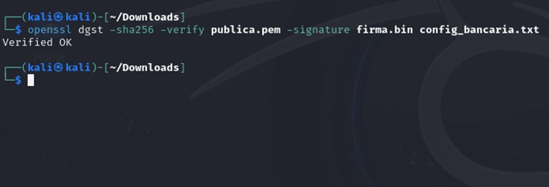

---

## Simulación de modificación del archivo

Desde la máquina atacante se modificó el contenido del archivo para alterar su integridad.

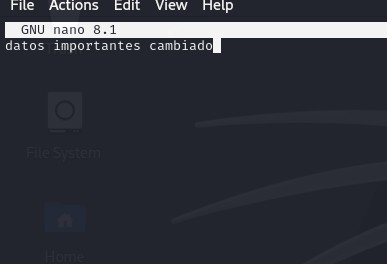

---

## Verificación fallida

Luego de modificar el archivo, la verificación de la firma digital falló correctamente, demostrando que el archivo había sido alterado.

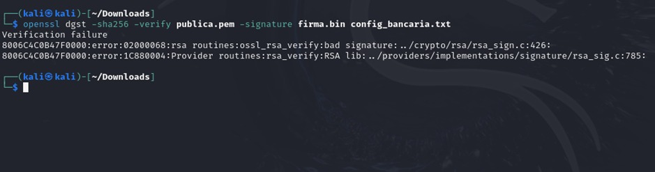

---

# Lab 2 - Ataque y Defensa de Credenciales

## Objetivo

Realizar un ataque de diccionario contra el servicio SSH utilizando Hydra y posteriormente implementar autenticación multifactor (MFA) para aumentar la seguridad del sistema.

---

## Ataque con Hydra

Desde Kali Linux se ejecutó un ataque de diccionario contra el servicio SSH del servidor Ubuntu.

```bash
hydra -l usuario -P lista_passwords.txt ssh://IP_SERVIDOR
```

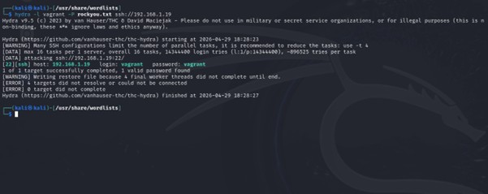

---

## Instalación de Google Authenticator

Se instaló el módulo PAM de Google Authenticator en Ubuntu Server.

```bash
sudo apt install libpam-google-authenticator
```

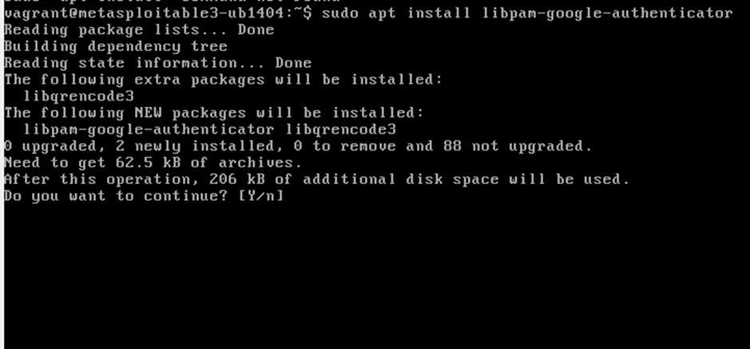

---

## Configuración del autenticador

Se ejecutó el comando:

```bash
google-authenticator
```

Luego se configuró el código QR en la aplicación móvil.

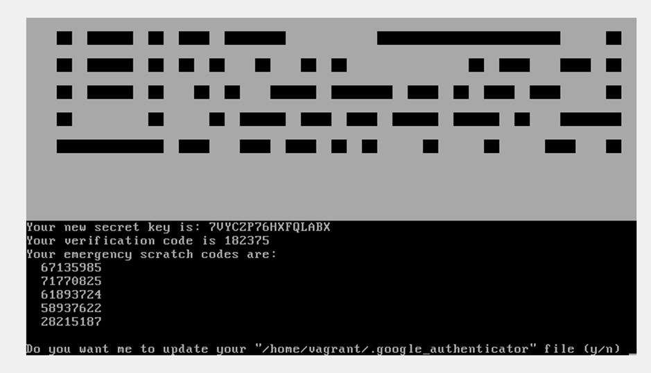

---

## Configuración de PAM para SSH

Se editó el archivo:

```bash
/etc/pam.d/sshd
```

Agregando la siguiente línea:

```bash
auth required pam_google_authenticator.so
```

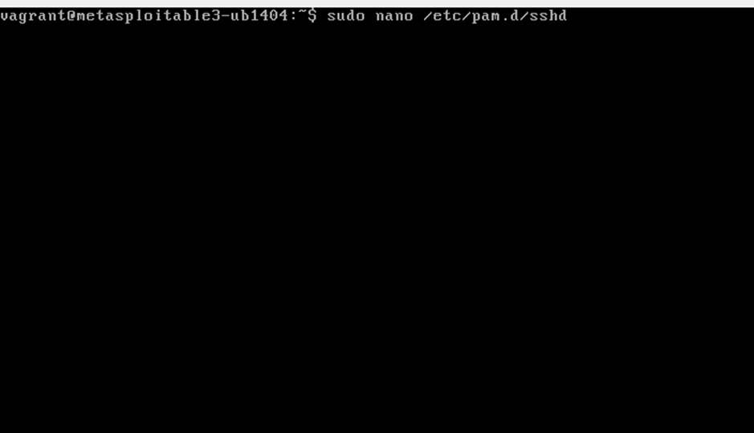

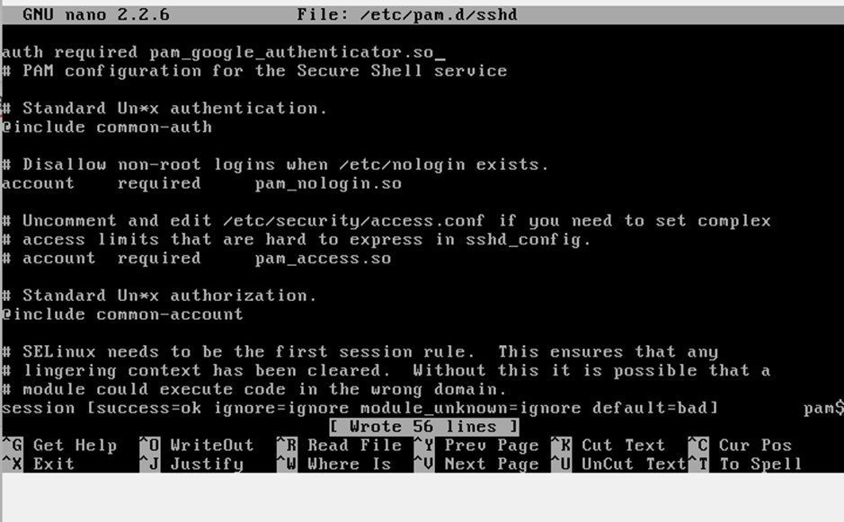

---

## Configuración del servicio SSH

Se modificó el archivo:

```bash
/etc/ssh/sshd_config
```

Configurando los siguientes parámetros:

```bash
ChallengeResponseAuthentication yes
PasswordAuthentication yes
UsePAM yes
```

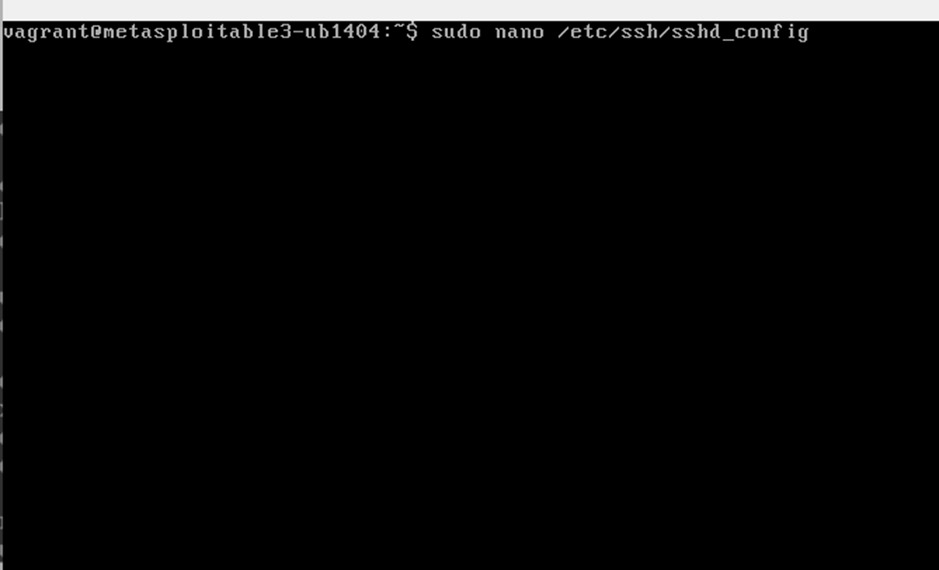

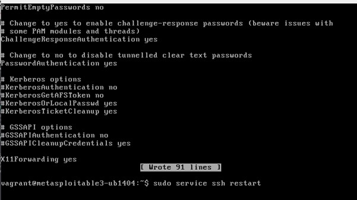

---

## Reinicio del servicio SSH

Para aplicar los cambios se reinició el servicio SSH.

```bash
sudo service ssh restart
```

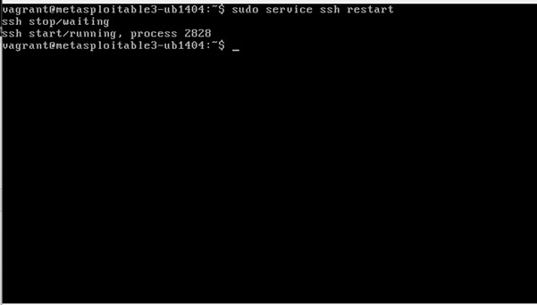

---

## Verificación final

Finalmente se volvió a ejecutar Hydra. Aunque la contraseña era correcta, el acceso fue bloqueado debido a la autenticación multifactor.

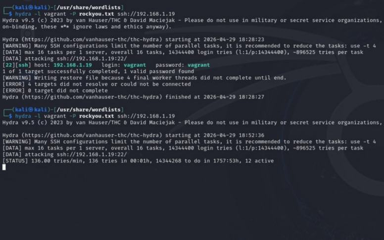

---

# Lab 3 - Protocolos de Comunicación Seguros

## Objetivo

Analizar tráfico inseguro mediante Wireshark y posteriormente aplicar técnicas de protección utilizando túneles SSH para evitar la visualización de información sensible en texto plano.

---

## Captura de tráfico HTTP inseguro

Se realizó una captura de tráfico utilizando Wireshark mientras se enviaban credenciales mediante HTTP.

El objetivo fue demostrar cómo un atacante puede visualizar información sensible cuando las comunicaciones no están cifradas.

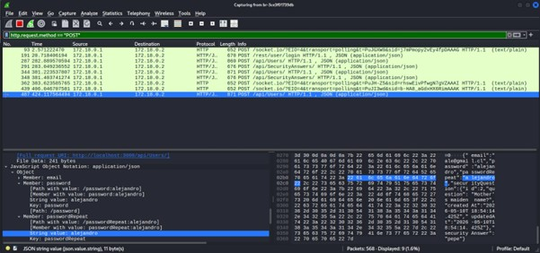

En Wireshark fue posible observar credenciales y datos transmitidos en texto plano utilizando el filtro:

```bash
http.request.method == "POST"
```

---

## Implementación de túnel SSH

Para proteger el tráfico se implementó un túnel SSH.

Primero se obtuvo la dirección IP del contenedor Docker mediante el siguiente comando:

```bash
sudo docker inspect -f '{{range.NetworkSettings.Networks}}{{.IPAddress}}{{end}}' ID_DEL_CONTENEDOR
```

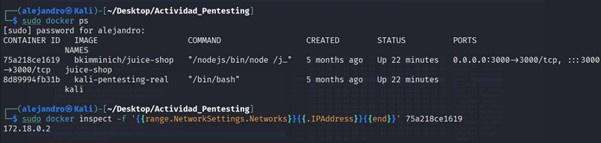

---

## Activación del servicio SSH

Posteriormente se habilitó e inició el servicio SSH.

```bash
sudo systemctl enable ssh
sudo systemctl start ssh
```

Luego se creó el túnel SSH:

```bash
ssh -L 8080:172.18.0.2:3000 usuario@localhost
```

Este comando permitió redirigir el tráfico local mediante una conexión cifrada.

---

## Acceso mediante túnel seguro

Después de establecer el túnel se accedió al sitio web desde:

```bash
http://localhost:8080
```


---

## Envío de información protegida

Se ingresaron nuevamente los datos mediante la conexión protegida por SSH.


---

## Verificación del tráfico cifrado

Finalmente se volvió a analizar el tráfico utilizando Wireshark.

A diferencia de la prueba anterior, los datos ya no podían visualizarse en texto plano, demostrando que el túnel SSH protegió correctamente la información transmitida.

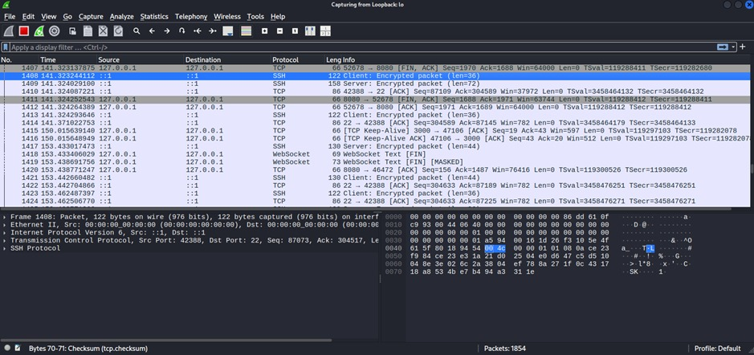

---

# Conclusión

Durante los laboratorios se trabajó con distintos escenarios reales de ciberseguridad relacionados con criptografía, integridad de datos, autenticación multifactor y protección de comunicaciones.

En el Lab 1 se comprobó cómo las firmas digitales permiten detectar modificaciones en archivos críticos.

En el Lab 2 se realizó un ataque de fuerza bruta utilizando Hydra y posteriormente se fortaleció la seguridad mediante autenticación multifactor (MFA).

Finalmente, en el Lab 3 se demostró la diferencia entre tráfico HTTP inseguro y tráfico protegido mediante túneles SSH, comprobando el funcionamiento del cifrado en la protección de datos sensibles.

Estos laboratorios permitieron comprender tanto técnicas ofensivas como defensivas utilizadas actualmente en entornos de ciberseguridad.
